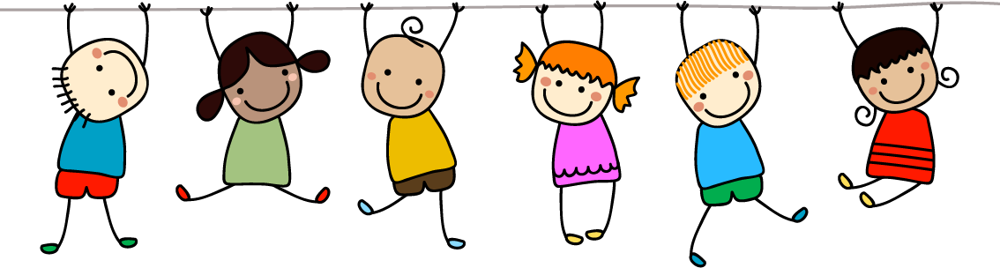

<h1 align = "center"> Hola 😊, soy Lorena </h1>
<h3 align = "center"> Presento la descripción de mi proyecto " Había Una Vez "</h3>

- 💻🤓 Actualmente estoy aprendiendo ** Desarrollo WEB **

# **Sitio: Había una Vez**

## DESCRIPCIÓN DEL SITIO: 
Sitio orientado a lectura infantil, con publicación de fábulas y  cuentos clásicos que contienen enseñanza de valores, así también publicación de cuentos escritos por los niños usuarios del sitio.

## OBJETIVO GENERAL: 
Enseñanzar y fortalecer los Valores en los niños usando Cuentos, fomentar e inspirar el hábito de la Lectura y escritura Infantil. 

## USUARIOS OBJETIVO: 
Niños y padres con niños. Enfocado a menores de 12 años.

- (https://ldlrl.github.io/DesarrolladorWeb-curso/)

### AUTORÍA

* Lorena De La Riva

ESTUDIANTE CODERHOUSE 
Santiago de Chile, marzo de 2021 
 

<h3 align =" left "> Herramientas: </h3>

       

