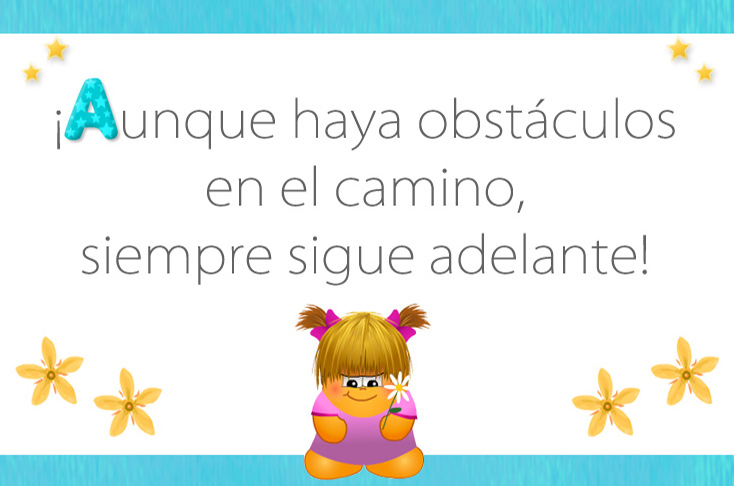

<h1 align = "center"> Hola 😊, soy Lorena </h1>
<h3 align = "center"> Presento la descripción de mi proyecto actual "Sitio WEB: Había Una Vez "</h3>

- 💻🤓 Actualmente estoy aprendiendo ** Desarrollo WEB **

  

&nbsp;

# **✩ Había una Vez ✩**

### DESCRIPCIÓN DEL SITIO: 
Sitio orientado a lectura infantil, con publicación de fábulas y  cuentos clásicos que contienen enseñanzas de valores, así también publicaciones de cuentos escritos por los niños usuarios del sitio.

### FINALIDAD:
📚  Enseñar y fortalecer los Valores en los niños por medio de Cuentos. 
📖  Fomentar e inspirar el hábito de la Lectura y Escritura Infantil. 

### USUARIOS OBJETIVO: 
👧👦👨‍👨‍👦‍👦
Niños y Padres con niños. Enfocado a menores de 12 años.

### ENLACE: 
🟢✔(https://ldlrl.github.io/DesarrolladorWeb-curso/)

## AUTORÍA:
* © Lorena De La Riva 
ESTUDIANTE CODERHOUSE 
Santiago de Chile, marzo de 2021 

## HERRAMIENTAS:

    <a href="https://www.w3.org/html/" target="_blank">   </a>  

  
